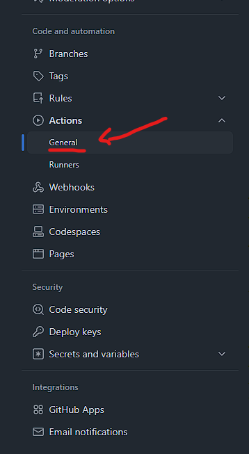

# Semantic Release Guide

This repository provides a comprehensive guide to using Semantic Release for automated versioning, as well as an example of how to configure it using [Github Actions](https://github.com/features/actions).

## What is Semantic Release?

Semantic Release automates the entire package release workflow, including:

- **Determining the next version number:** Based on your commit messages, adhering to semantic versioning.
- **Generating release notes:** Automatically creating detailed changelogs.
- **Publishing the package:** To your chosen registry (e.g., npm, PyPI, GitHub Releases). `Not included in this guide.`

This eliminates the manual, error-prone process of versioning and releasing software.

## Why Use Semantic Release?

- **Automation:** Frees up developer time and reduces manual errors.
- **Consistency:** Ensures consistent and predictable releases.
- **Semantic Versioning:** Enforces adherence to semantic versioning standards.
- **Improved Collaboration:** Provides clear and automated release notes.

## Table of Contents

- [Prerequisites](#prerequisites)
- [Installation](#installation)
- [Configuration](#configuration)
  - [Plugins](#plugins)
  - [Commit Message Conventions](#commit-message-conventions)
  - [Release Configuration File](#release-configuration-file)
- [Continuous Integration (CI) Setup](#continuous-integration-ci-setup)
  - [GitHub Actions](#github-actions)
  - [Github Configuration](#github-configuration)

## Prerequisites

- A GitHub repository.

- Node.js installed.

- A basic understanding of Git and npm.

- A CI/CD pipeline (GitHub Actions) configured.

## Installation

Semantic Release CLI can be installed using `npm`, for this example we will be using `npm@10.9.2`.

```bash
# Example for npm:
npm install --save-dev semantic-release
```

## Configuration

### Commit Message Conventions

Semantic release is configued to run based on the commit message pushed to the selected branch, for our case we will be using `main` branch.

It uses [Conventional Commits](https://www.conventionalcommits.org/en/v1.0.0/) for the commit message in order to understand the type of change, and, based on the commit generate therespective version, `Mayor`, `Minor`, `Fix`.

For our case we will be ussing [commitizen](https://www.npmjs.com/package/commitizen) which is a CLI that helps us set up the commit easier by running a command and following a couple of steps.

- Install Commitizen and cz-conventional-changelog for commitizen config:
  > ```bash
  > npm install --save-dev commitizen cz-conventional-changelog
  > ```
- Usage of commitizen
  > You can either use `npx cz` to start the CLI
  > or you can create a script for it on `package.json` to use it as `npm run commit`
  >
  > ```
  > ...
  > "scripts": {
  >   "commit": "cz"
  > }
  > ...
  >
  > ```
- Add `.czrc` file for Commitizen config
  > ```
  > {
  >  "path": "cz-conventional-changelog"
  > }
  > ```

### Plugins

We will be using different plugins for our configuration since each one of them are gonna be executing something different.

Install next plugins for semantic-release:

```bash
npm install --save-dev @semantic-release/changelog @semantic-release/git @semantic-release/github @semantic-release/release-notes-generator
```

- @semantic-release/changelog

  > emantic-release plugin to generate a `CHANGELOG.md` based on the commits pushed to the specified branch.

- @semantic-release/git

  > emantic-release plugin to verify the access to the remote Git repository, the commit message format and the assets option configuration.

- @semantic-release/github

  > semantic-release plugin to publish a GitHub release and comment on released Pull Requests/Issues.

- @semantic-release/release-notes-generator
  > semantic-release plugin to generate changelog content with conventional-changelog

### Release Configuration File

Then once you have dependencies installed you will have to create a `.releaserc.json` file. This will be used as configuration for your semantic release execution.

Content for `.releaserc.json`:

```
{
  "branches": ["main"],
  "plugins": [
    "@semantic-release/commit-analyzer",
    "@semantic-release/release-notes-generator",
    "@semantic-release/changelog",
    "@semantic-release/github",
    ["@semantic-release/git", {
      "assets": ["CHANGELOG.md", "package.json"],
      "message": "chore(release): ${nextRelease.version} [skip ci]\n\n${nextRelease.notes}"
    }]
  ]
}
```

## Continuous Integration (CI) Setup

For our CI we will be using [Github Actions](https://github.com/features/actions), but feel free to use your preferred CI, just remember to add the required permissions and tokens.

### GitHub Actions

Add on `.github/workflows` your file for build, test and release. we will be adding it with the name `ci-pipeline.yml` but feel free to select your own name based on what you will be doing.

(Recommended) Install [commitlint](https://commitlint.js.org/) with:

> ```bash
> npm install --save-dev @commitlint/{cli,config-conventional}
> ```
>
> And run next command to create commitlint config file
>
> ```bash
> echo "export default { extends: ['@commitlint/config-conventional'] };" > commitlint.config.js
> ```

File content:

```
name: CI Pipeline

on:
  push:
    branches:
      - "**" # Run for all branches

jobs:
  build-and-test:
    # Replace ubuntu latest for an specific version so you can reproduce error if required
    runs-on: ubuntu-latest
    steps:
      - name: Checkout Code
        uses: actions/checkout@v4

      # Se tup Node.js
      - name: Setup Node.js
        uses: actions/setup-node@v4
        with:
          ## Use latest Node.js 22
          node-version: "22.x"

      - name: Install dependencies
        # Clean Install
        run: npm ci

      # Cache node_modules to use install only once
      - name: Cache node_modules
        uses: actions/cache@v3
        with:
          path: node_modules
          key: ${{ runner.os }}-node_modules-${{ hashFiles('**/package-lock.json') }}
          restore-keys: ${{ runner.os }}-node_modules-

      # Check if commit message is a conventional commit message
      - name: Commit Lint
        # This will check your last commit and return an error if invalid or a positive output if valid.
        run: npx commitlint --from HEAD~0 --to HEAD --verbose

      # Run build of the app (as this step you can add audit, linter or any other step you want to check)
      - name: Run build
        run: npm run build

      # Replace with your test coverage command
      - name: Run Tests with coverage
        id: tests
        # If you have another command for your tests run it here
        run: npm test
        continue-on-error: false

      # Add one for each folder you require to upload
      - name: Upload Test Coverage
        # Run even if tests fail
        if: always()
        uses: actions/upload-artifact@v4
        with:
          name: Test Coverage
          path: coverage

  release:
    # Run only for main branch push
    if: github.ref == 'refs/heads/main'
    needs: build-and-test
    # Replace ubuntu latest for an specific version so you can reproduce error if required
    runs-on: ubuntu-latest
    # Required to generate releases
    permissions:
      contents: write
      issues: write
      packages: write
      pull-requests: write
    steps:
      - name: Checkout repository
        uses: actions/checkout@v4
        with:
          fetch-depth: 0

      - name: Setup Node.js
        uses: actions/setup-node@v4
        with:
          node-version: "22.x"

      - name: Restore node_modules cache
        uses: actions/cache@v3
        with:
          key: ${{ runner.os }}-node_modules-${{ hashFiles('**/package-lock.json') }}
          restore-keys: ${{ runner.os }}-node_modules-

      - name: Run Semantic Release
        env:
          # this env var is provided by github actions, for other CI you may require to create your own token
          GITHUB_TOKEN: ${{ secrets.GITHUB_TOKEN }}
        run: npx semantic-release
```

### Github Configuration

Github configuration is required for you to be able to run semantic-release, it is recommended to enable branch protection as this will prevent errors generating releases.

1. Click on Settings
   
2. Click on Rulesets
   
3. Create a new branch ruleset
   
4. Name the rule (we will be using value `main`, as it is for main branch)
5. Remember to enable the rule
   
6. On `Target` section Add target `Include default branch` (for our case it is our main branch)
   
7. Within Rules enable `Require a pull request before merging` and set `Require approvals` to at least 1 and set `Allowed merge methods` to only `Squash` (with this you make sure only one commit at a time can be pushed to main branch)
   
8. Enable `Require status checks to pass` and select `build-and-test` from Github actions
   
9. Click on `Create`
   
10. Go to Section Actions on the menu at the left and select `General`
    
11. In the section `Workflow permissions` be sure to enable `Read and write permissions` as this is required to be able to generate releases and push to main branch changelogs.
    

Now you should be all set up to generate automatically your releases!
